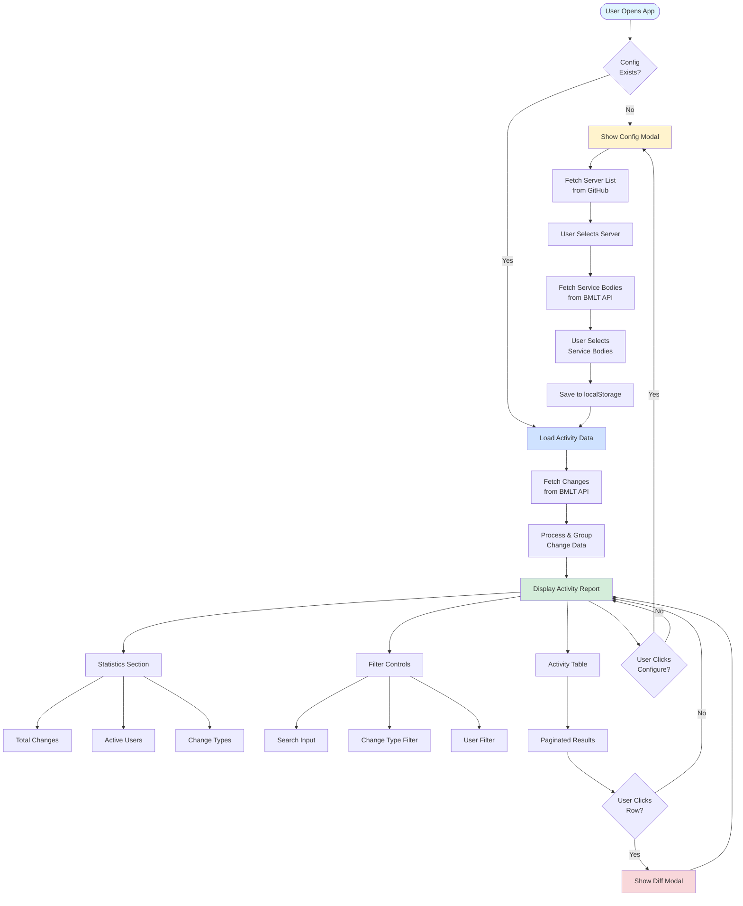

# Contributing to BMLT Server Activity Report

Thank you for your interest in contributing to the BMLT Server Activity Report! This document provides guidelines and information for contributors.

## Table of Contents

- [Getting Started](#getting-started)
- [Development Setup](#development-setup)
- [Project Structure](#project-structure)
- [Development Guidelines](#development-guidelines)
- [Testing](#testing)
- [Code Style](#code-style)
- [Pull Request Process](#pull-request-process)
- [Architecture Overview](#architecture-overview)

## Getting Started

### Prerequisites

- Node.js 24 or higher
- npm or yarn
- Git

### Development Setup

1. **Fork the repository**
   ```bash
   # Click the "Fork" button on GitHub, then clone your fork
   git clone https://github.com/YOUR_USERNAME/activity.git
   cd activity
   ```

2. **Install dependencies**
   ```bash
   npm install
   ```

3. **Start development server**
   ```bash
   npm run dev
   ```

4. **Create a feature branch**
   ```bash
   git checkout -b feature/your-feature-name
   ```

## Project Structure

```
src/
├── components/          # Svelte components
│   ├── ActivityReport.svelte    # Main report component
│   ├── ActivityTable.svelte     # Paginated activity table
│   ├── ConfigModal.svelte       # Configuration dialog
│   ├── DarkMode.svelte          # Dark mode toggle component
│   ├── Filters.svelte           # Search and filter controls
│   ├── SettingsModal.svelte     # Language settings dialog
│   └── Stats.svelte             # Statistics display
├── lib/
│   ├── services/        # API service layers
│   │   ├── bmltApi.ts           # BMLT change data fetching
│   │   └── serverList.ts        # Server and service body discovery
│   ├── stores/          # State management
│   │   ├── config.svelte.ts     # Config store with localStorage persistence
│   │   └── localization.ts      # i18n translations store (en/es)
│   ├── utils/           # Utility functions
│   │   ├── dataProcessing.ts    # Data transformation and aggregation
│   │   ├── detailsFormatter.ts  # Format change details for display
│   │   └── diff.ts              # Generate line-by-line diffs
│   └── types.ts         # TypeScript type definitions
└── tests/               # Test files
```

## Development Guidelines

### Svelte 5 Patterns

This project uses Svelte 5's new runes-based reactivity system:

- **`$state()`** - Declare reactive state variables
- **`$derived()` / `$derived.by()`** - Create computed values that automatically update
- **`$bindable()`** - Create two-way bindable props in components
- **`$effect()`** - Run side effects when dependencies change

**Avoid** the old `$:` reactive syntax - it's deprecated in Svelte 5.

#### Example Component

```svelte
<script lang="ts">
  interface Props {
    initialValue: number;
  }
  
  let { initialValue }: Props = $props();
  
  // Reactive state
  let count = $state(initialValue);
  
  // Derived/computed value
  let doubled = $derived(count * 2);
  
  // Effect
  $effect(() => {
    console.log('Count changed:', count);
  });
  
  function increment() {
    count++;
  }
</script>

<button onclick={increment}>
  Count: {count} (Doubled: {doubled})
</button>
```

### State Management

- **Config Store** (`config.svelte.ts`): Uses class-based pattern with private `$state` fields and getters/setters that persist to localStorage
- **Localization Store** (`localization.ts`): Wraps `localized-strings` with Svelte store for reactive translations
- Component-local state should use `$state()` runes

### API Integration

- Use the `BmltClient` from `bmlt-query-client` package
- Date ranges should be formatted as ISO date strings (`YYYY-MM-DD`)
- Service body IDs must be parsed as integers when passing to API
- Handle errors gracefully - API calls may fail due to network or server issues

### Adding Translations

When adding new UI text:

1. Add keys to both `en` and `es` objects in `src/lib/stores/localization.ts`
2. Keep keys in alphabetical order (enforced by ESLint)
3. Use the `$translations` store in components:
   ```svelte
   <script lang="ts">
     import { translations } from '../lib/stores/localization';
   </script>
   
   <h1>{$translations.title}</h1>
   ```

### Dark Mode Support

When adding new UI elements:

- Use Tailwind's `dark:` variant for dark mode styles
- For text: `text-gray-900 dark:text-gray-100`
- For backgrounds: `bg-white dark:bg-gray-900`
- For borders: `border-gray-200 dark:border-gray-700`
- Use `text-blue-600 dark:text-blue-400` for accent colors (service bodies, links, icons)

## Testing

### Running Tests

```bash
npm test              # Run all tests once
npm run test:watch    # Watch mode for development
npm run test:ui       # Interactive Vitest UI
npm run coverage      # Generate coverage report
```

### Writing Tests

We use Vitest + Testing Library for Svelte. Tests should be colocated in the `src/tests/` directory.

#### Component Test Example

```typescript
import { describe, test, expect } from 'vitest';
import { render, screen } from '@testing-library/svelte';
import userEvent from '@testing-library/user-event';
import MyComponent from '../../components/MyComponent.svelte';

describe('MyComponent', () => {
  test('renders correctly', () => {
    render(MyComponent, { props: { title: 'Test' } });
    expect(screen.getByText('Test')).toBeInTheDocument();
  });

  test('handles user interaction', async () => {
    const user = userEvent.setup();
    render(MyComponent, { props: { title: 'Test' } });
    
    const button = screen.getByRole('button');
    await user.click(button);
    
    expect(screen.getByText('Clicked')).toBeInTheDocument();
  });
});
```

#### Utility Test Example

```typescript
import { describe, test, expect } from 'vitest';
import { myUtilityFunction } from '../lib/utils/myUtil';

describe('myUtilityFunction', () => {
  test('processes data correctly', () => {
    const input = { foo: 'bar' };
    const result = myUtilityFunction(input);
    expect(result).toEqual({ foo: 'BAR' });
  });
});
```

### Coverage Requirements

- Maintain minimum 93% coverage for all new code
- All new features must include tests
- Bug fixes should include regression tests

## Code Style

### TypeScript

- Use TypeScript for all new code
- Define interfaces for component props
- Add types to function parameters and return values
- Use `type` for unions/intersections, `interface` for object shapes

### Formatting

The project uses Prettier with these settings:

- Line width: 200 characters
- Single quotes
- Semicolons required
- No trailing commas
- 2-space indentation

**Format your code before committing:**

```bash
npm run format
```

### Linting

ESLint is configured with strict rules:

```bash
npm run lint
```

Fix auto-fixable issues:

```bash
npm run lint -- --fix
```

### Import Order

Organize imports in this order:

1. Svelte imports (`svelte`, `svelte/store`)
2. External libraries
3. Internal components
4. Internal utilities/services
5. Types
6. Styles

```typescript
import { onMount } from 'svelte';
import { Button, Modal } from 'flowbite-svelte';
import MyComponent from './MyComponent.svelte';
import { fetchData } from '../lib/services/api';
import type { MyType } from '../lib/types';
import './styles.css';
```

## Pull Request Process

1. **Ensure your code follows all guidelines**
   ```bash
   npm run lint    # Must pass
   npm test        # All tests must pass
   npm run format  # Format code
   ```

2. **Update documentation**
   - Add JSDoc comments for new functions
   - Update README.md if adding user-facing features
   - Update CONTRIBUTING.md if changing dev processes

3. **Write a clear PR description**
   - Explain what changes you made and why
   - Reference any related issues
   - Include screenshots for UI changes
   - List any breaking changes

4. **PR Title Format**
   - Use conventional commits format:
     - `feat: add Spanish translations`
     - `fix: correct date formatting in table`
     - `docs: update README with new features`
     - `test: add tests for ActivityTable component`
     - `refactor: simplify data processing logic`
     - `chore: update dependencies`

5. **Wait for review**
   - Address any feedback from maintainers
   - Keep your branch up to date with main
   - Be responsive to comments

## Architecture Overview

### Data Flow Diagram



### Key Concepts

1. **Configuration** - Loaded from localStorage on app start
2. **Server Discovery** - Fetched from GitHub aggregator repository
3. **Change Fetching** - Retrieved via bmlt-query-client library
4. **Data Processing** - Groups changes by user and calculates statistics
5. **Client-side Filtering** - Applied in-memory for instant results
6. **Persistent Settings** - Language, theme, and config saved to localStorage

### LocalStorage Keys

- `bmlt-activity-report-config` - Main configuration object
- `activityLanguage` - Language preference (`en` or `es`)
- `color-theme` - Theme preference (`light` or `dark`)

## Questions or Issues?

- For bugs or feature requests: [Open an issue](https://github.com/bmlt-enabled/activity/issues)
- For questions: Start a [discussion](https://github.com/bmlt-enabled/activity/discussions)
- For security issues: Email security@bmlt.app

## Code of Conduct

Please be respectful and constructive in all interactions. We're all here to make the BMLT ecosystem better!

Thank you for contributing! 🎉
