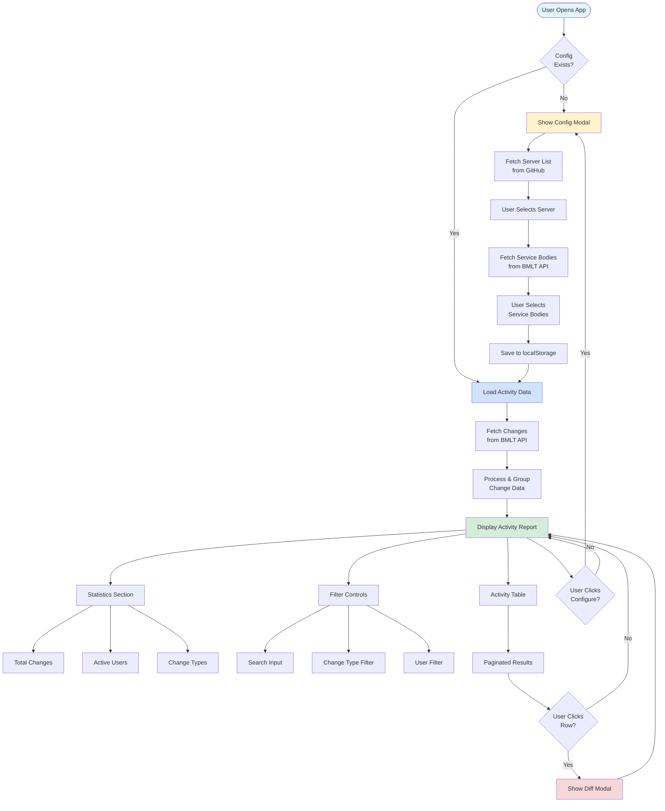

# BMLT Server Activity Report

[](https://github.com/bmlt-enabled/activity/actions/workflows/test.yml)
[](https://github.com/bmlt-enabled/activity/actions/workflows/release.yml)
[](https://codecov.io/gh/bmlt-enabled/activity)
[](https://opensource.org/licenses/MIT)
[](https://github.com/bmlt-enabled/activity/releases)

A modern Svelte 5 application that displays change activity reports from BMLT (Basic Meeting List Toolbox) servers. Track meeting changes, view statistics, and monitor service body activity with an intuitive, responsive interface.

## Features

- 📊 **Comprehensive Statistics** - View total changes, active users, and change type breakdowns
- 🔍 **Advanced Filtering** - Search and filter by meeting name, user, change type, or service body
- 📅 **Configurable Date Ranges** - Review activity from 1 to 365 days
- 🌐 **Multi-Server Support** - Connect to any BMLT root server
- 🎯 **Service Body Selection** - Track specific service bodies or entire regions
- 📱 **Responsive Design** - Works seamlessly on desktop and mobile devices
- 🔄 **Real-time Diff Viewer** - See detailed line-by-line changes for each modification
- 💾 **Persistent Configuration** - Settings saved to browser localStorage

## Architecture



## Technology Stack

- **Framework**: [Svelte 5](https://svelte.dev/) with runes-based reactivity
- **Language**: TypeScript
- **Build Tool**: Vite
- **Styling**: Tailwind CSS v4
- **UI Components**: [Flowbite Svelte](https://flowbite-svelte.com/)
- **API Client**: [bmlt-query-client](https://www.npmjs.com/package/bmlt-query-client)
- **Testing**: Vitest + Testing Library

## Getting Started

### Prerequisites

- Node.js 24 or higher
- npm or yarn

### Installation

```bash
# Clone the repository
git clone https://github.com/bmlt-enabled/activity.git
cd activity

# Install dependencies
npm install
```

### Development

```bash
# Start development server with hot reload
npm run dev

# Run tests
npm test

# Run tests in watch mode
npm run test:watch

# Generate coverage report
npm run coverage

# Lint and format code
npm run lint
npm run format
```

### Building for Production

```bash
# Build optimized production bundle
npm run build

# Preview production build locally
npm run preview
```

## Configuration

On first launch, you'll be prompted to configure:

1. **BMLT Server** - Select from a list of available BMLT root servers
2. **Service Bodies** - Choose one or more service bodies to track
3. **Days to Look Back** - Specify how many days of history to fetch (1-365)

Configuration is automatically saved to your browser's localStorage and can be changed at any time using the Configure button.

## Project Structure

```
src/
├── components/          # Svelte components
│   ├── ActivityReport.svelte    # Main report component
│   ├── ActivityTable.svelte     # Paginated activity table
│   ├── ConfigModal.svelte       # Configuration dialog
│   ├── Filters.svelte           # Search and filter controls
│   └── Stats.svelte             # Statistics display
├── lib/
│   ├── services/        # API service layers
│   │   ├── bmltApi.ts           # BMLT change data fetching
│   │   └── serverList.ts        # Server and service body discovery
│   ├── stores/          # State management
│   │   └── config.svelte.ts     # Config store with localStorage persistence
│   ├── utils/           # Utility functions
│   │   ├── dataProcessing.ts    # Data transformation and aggregation
│   │   ├── detailsFormatter.ts  # Format change details for display
│   │   └── diff.ts              # Generate line-by-line diffs
│   └── types.ts         # TypeScript type definitions
└── tests/               # Test files
```

## Key Features Explained

### Svelte 5 Runes

This project uses Svelte 5's new runes-based reactivity:

- `$state()` - Reactive state variables
- `$derived()` - Computed values that auto-update
- `$bindable()` - Two-way binding for component props
- `$effect()` - Side effects triggered by state changes

### Data Flow

1. **Configuration** is loaded from localStorage on app start
2. **Server List** is fetched from the [bmlt-enabled/aggregator](https://github.com/bmlt-enabled/aggregator) repository
3. **Service Bodies** are retrieved from the selected BMLT server
4. **Change Records** are fetched via the bmlt-query-client library
5. **Data Processing** groups changes by user and calculates statistics
6. **Filtering** is applied client-side for instant results
7. **Pagination** displays changes in manageable chunks

### LocalStorage Schema

Configuration is stored under the key `bmlt-activity-report-config`:

```json
{
  "bmltServer": "https://example.com/main_server",
  "serviceBodyIds": ["123", "456"],
  "daysPassed": 30,
  "timezone": "America/New_York"
}
```

## Testing

The project maintains high test coverage:

- Unit tests for utilities and services
- Component tests using Testing Library
- Coverage reports generated with Vitest + V8

Run tests with:

```bash
npm test              # Run all tests once
npm run test:watch    # Watch mode
npm run test:ui       # Interactive UI
npm run coverage      # Generate coverage report
```

## Contributing

Contributions are welcome! Please:

1. Fork the repository
2. Create a feature branch (`git checkout -b feature/amazing-feature`)
3. Commit your changes (`git commit -m 'Add amazing feature'`)
4. Push to the branch (`git push origin feature/amazing-feature`)
5. Open a Pull Request

Ensure all tests pass and code is formatted:

```bash
npm run lint
npm test
```

## License

This project is licensed under the MIT License - see the [LICENSE](LICENSE) file for details.

## Credits

- Bootstrapped with [Svelte 5 + TypeScript + Vite + Tailwind CSS Bootstrap](https://github.com/pjaudiomv/svelte5-vite-ts-tailwind-eslint)
- Built for the [BMLT (Basic Meeting List Toolbox)](https://bmlt.app/) community

## Support

For issues, questions, or suggestions, please [open an issue](https://github.com/bmlt-enabled/activity/issues) on GitHub.
